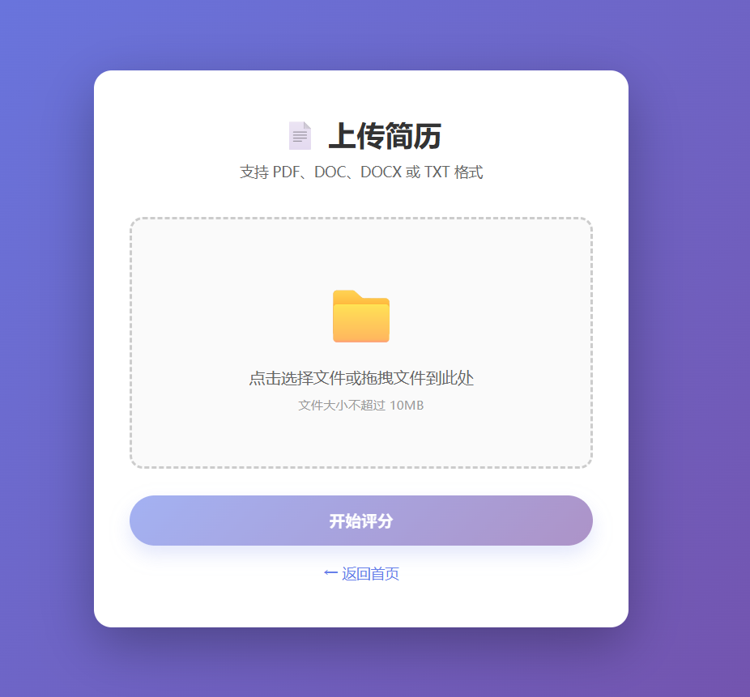
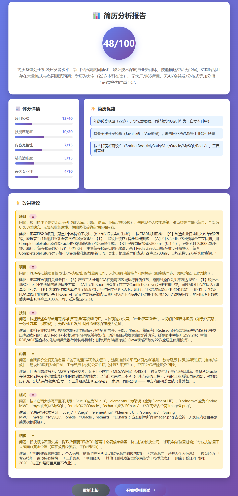
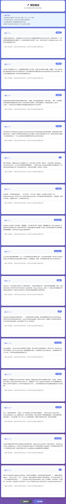
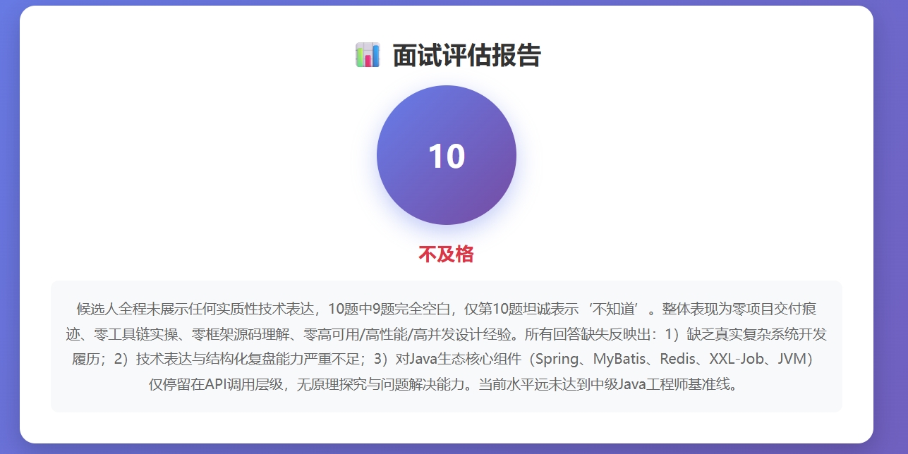
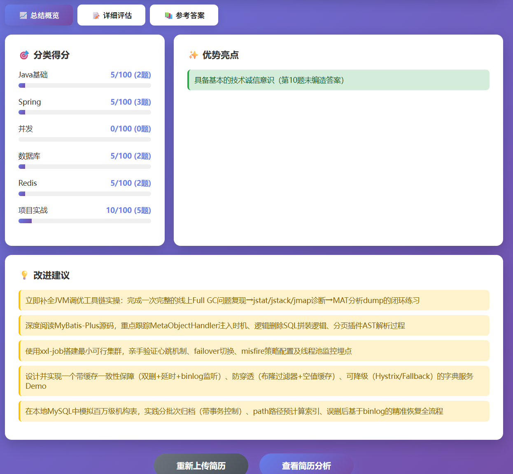

<h1 align="center">模拟面试器</h1>

一个基于 AI 的智能模拟面试系统，提供简历评分、个性化面试问题生成和答案评估功能。

### 可用于：
1. 毕业设计
2. 简历优化、模拟面试
3. 学习


## 功能特点


### 1. 📄 智能简历评分

- 多维度深度分析（项目经验、技能匹配、内容完整性、结构清晰度、表达专业性）
- 提供具体的优化建议和改进方案
- 基于资深技术架构师的视角进行"穿透式"审计

### 2. 🎤 个性化模拟面试

- 根据简历内容定制专属面试问题
- 覆盖 Java 基础、并发编程、数据库、缓存、Spring、Ai 框架等多个技术领域
- 题目难度梯度分布（基础 30%、进阶 50%、专家 20%）

### 3. 📊 深度答案评估


- 全方位专业评估（准确性 40%、完整性 20%、深度 25%、表达 15%）
- 详细反馈指出优点与不足
- 提供源码级参考答案和核心要点

## 技术栈

- **后端框架**: Spring Boot 3.5.7
- **AI 模型**: Spring AI Alibaba (通义千问)
- **模板引擎**: Thymeleaf
- **开发语言**: Java 17
- **前端**: HTML5 + CSS3 + JavaScript

## 快速开始

### 环境要求
- JDK 17+
- Maven 3.6+
- 通义千问 API Key

### 配置步骤

1. **设置 API Key**
   
   在 `application.yml` 中配置你的 API Key：
   ```yaml
   spring:
     ai:
       dashscope:
         api-key: your-api-key-here
   ```

2. **启动应用**
   ```bash
   cd mock-interview-agent
   mvn spring-boot:run
   ```

3. **访问应用**
   
   打开浏览器访问：http://localhost:8080

## 使用流程

### 步骤 1: 上传简历
- 支持 PDF、DOC、DOCX、TXT 格式
- 文件大小不超过 10MB
- 可直接拖拽或点击选择

### 步骤 2: 查看简历分析
- 查看综合评分（满分 100 分）
- 了解各维度得分详情
- 阅读优势分析和改进建议

### 步骤 3: 开始模拟面试
- 系统自动生成针对性面试问题
- 问题涵盖项目经历和技术基础
- 认真作答每个问题

### 步骤 4: 获得评估报告
- 查看整体评分和等级
- 了解各领域掌握情况
- 学习参考答案和核心要点

## 项目结构

```
mock-interview-agent/
├── src/main/
│   ├── java/com/cloud/alibaba/ai/example/claw/skillsagentexample/
│   │   ├── controller/
│   │   │   └── MockInterviewController.java      # Web 控制器
│   │   ├── service/
│   │   │   ├── MockInterviewService.java         # 业务逻辑
│   │   │   └── dto/                              # 数据传输对象
│   │   │       ├── ResumeScoreResult.java
│   │   │       ├── InterviewQuestions.java
│   │   │       ├── InterviewEvaluation.java
│   │   │       └── ResumeData.java
│   │   └── ClawAgentExampleApplication.java      # 启动类
│   └── resources/
│       ├── templates/                            # HTML 模板
│       │   ├── index.html                        # 首页
│       │   ├── upload.html                       # 上传页面
│       │   ├── analysis.html                     # 分析结果
│       │   ├── interview.html                    # 面试页面
│       │   └── result.html                       # 评估结果
│       ├── prompt/                               # AI 提示词
│       │   ├── resume-analysis-system.st
│       │   ├── resume-analysis-user.st
│       │   ├── interview-question-system.st
│       │   └── interview-evaluation-system.st
│       └── application.yml                       # 配置文件
└── pom.xml                                       # Maven 配置
```

## 核心功能说明

### 简历评分系统
基于以下维度进行全面评估：
- **项目经验 (40 分)**: 技术深度、业务价值、量化成果
- **技能匹配 (20 分)**: 技术栈专业度、核心能力突出
- **内容完整性 (15 分)**: 模块顺序合理性
- **结构清晰度 (15 分)**: 技术名词规范性
- **表达专业性 (10 分)**: 语言简洁性

### 面试问题生成
- 从简历中提取关键技术点
- 按照难度梯度出题（基础/进阶/专家）
- 问题类型覆盖：项目经历、Java 基础、集合、并发、MySQL、Redis、Spring、Spring Boot

### 答案评估系统
评估维度：
- **准确性 (40%)**: 技术概念正确性
- **完整性 (20%)**: 核心知识点覆盖
- **深度 (25%)**: 底层原理理解
- **表达 (15%)**: 逻辑清晰度

## 注意事项

1. **文件格式**: 目前仅支持文本格式的简历文件（PDF/DOC/DOCX/TXT）
2. **内存存储**: 数据存储在内存中，重启后会丢失（生产环境建议使用数据库）
3. **API 调用**: 需要稳定的网络连接访问通义千问 API
4. **响应时间**: AI 处理需要一定时间，请耐心等待

## 未来优化方向

- [ ] 性能优化，模拟面试、评估结果保存改为流式响应
- [ ] 数据持久化（MySQL/Redis）
- [ ] 用户系统和历史记录
- [ ] 更多面试模式（前端、后端、算法等）
- [ ] 实时面试模拟（视频/语音）
- [ ] 同行业绩对比分析

## 开发者

本项目基于 Spring AI Alibaba 框架开发

## 许可证

Apache License 2.0
